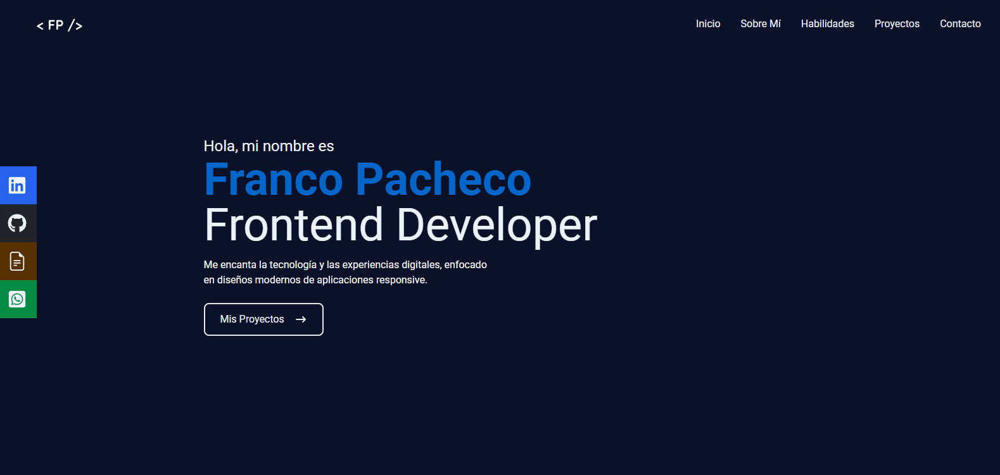

<h2 align="center">👋 Hi, I’m Franco Pacheco, a passionate 💻Full-Stack Developer💻</h2>

- 🚀 I'm studying in a BootCamp of Henry 👨‍🎓
- 👀 I’m interested in programming and tecnology!
- 💌 I’m looking for a remote job!
- 🙌 I’m looking to collaborate on any project
- ❤️ i enjoy learn everything!
- 📫 How to reach me :
  - Email: francopacheco.dev@gmail.com
  - Phone: +54 3855374571
  - LinkedIn: https://www.linkedin.com/in/francopachec0/
  - Portfolio: https://portfolio-pacheco.vercel.app/

<h2 align="left">🚀Skills</h2>
- JavaScript, HTML5, CSS3, React JS, Redux, PostgreSQL, Express JS, Sequelize.

<h2 align="left">📌My Projects</h2>
<h3 align="left">🐢 Pokemon App</h3>
  
<strong>
Technologies: </strong>ReactJS, Redux, HTML5, CSS3, NodeJS, ExpressJS, Sequelize, PostgreSQL

  
  
  
  
<h3 align="left">💼 Portfolio</h3>
  
<strong>
Technologies: </strong>ReactJS, Tailwind CSS, Full Responsive App.

https://portfolio-pacheco.vercel.app/

  <h3 align="left">🌎Countries App</h3>
  
<strong>
Technologies: </strong>ReactJS, Redux, HTML5, CSS3, NodeJS, ExpressJS, Sequelize, PostgreSQL

  
  
  
  

 

    
    

<!---
francopachec0/francopachec0 is a ✨ special ✨ repository because its `README.md` (this file) appears on your GitHub profile.
You can click the Preview link to take a look at your changes.
--->
